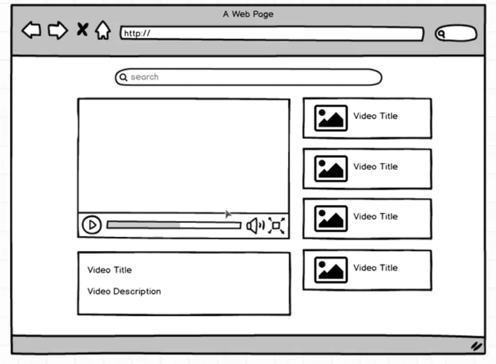

 

> 要做的效果

 

- search的部分可以做成一个组件
- 展示视频以及video title和video description部分可以做成一个组件
- Video列表可以做成一个组件，里面的每个项做成一个组件
- 整个页面做成一个组件

 

> mkdir src/components

 

> touch src/components/search_bar.js

 

> touch src/components/video_detail.js

 

> touch src/components/video_list.js

 

> touch src/components/video_list_item.js

 

